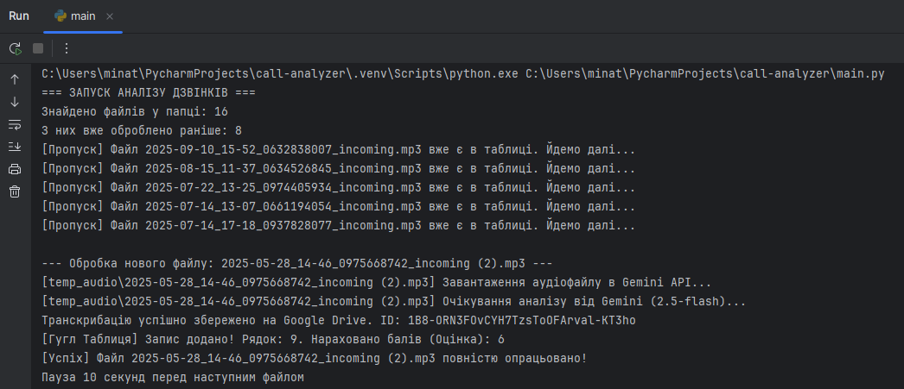
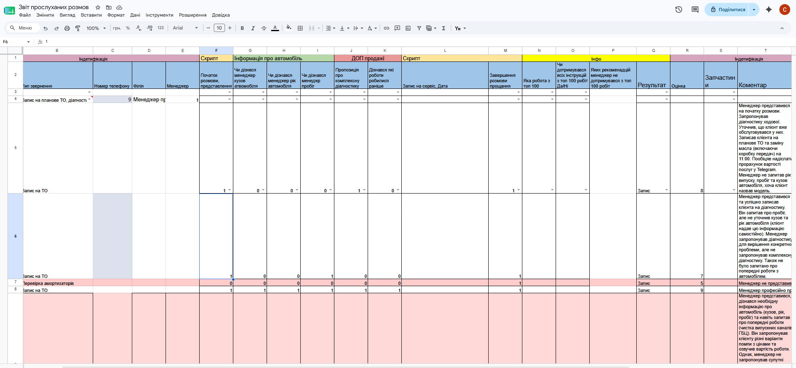

# AI Call Analyzer Platform

Автоматизована платформа для аналізу та контролю якості (QA) телефонних розмов менеджерів автосервісу. Система сканує аудіозаписи розмов із Google Drive, проводить детальний аналіз за допомогою штучного інтелекту **Gemini 2.5 Flash** (генерація повної транскрибації, оцінка чек-ліста, фіксація результату дзвінка) та заносить структуровані дані у Google Sheets з автоматичним колірним маркуванням проблемних зон.

## 🛠 Технологічний стек
* **Мова розробки:** Python 3.11+
* **ШІ Інтеграція:** Google GenAI API (Gemini 2.5 Flash)
* **Валідація даних:** Pydantic v2 & Pydantic Settings
* **Інтеграція з Google Cloud:** Google Drive API v3, Google Sheets API (gspread), OAuth 2.0 Аутентифікація

## 📋 Функціонал системи (згідно з ТЗ)
1. **Сканування та завантаження:** Автоматично знаходить нові `.mp3`/`.wav` файли у вхідній папці клієнта на Google Диску.
2. **Безпечна транскрибація:** Створює детальний `.txt` файл із повною розшифровкою розмови прямо в оперативній пам'яті (RAM) та завантажує його в робочу папку клієнта, не забиваючи локальний диск.
3. **Глибокий аналіз ШІ:** Оцінює виконання скрипта менеджером (привітання, збір інформації про авто, пропозиція діагностики, прощання тощо) за системою 1/0.
4. **Контекстний вибір:** ШІ вибирає послугу за списком ТОП-100 робіт СТО та обирає фінальний статус розмови.
5. **Динамічний підрахунок балів:** Підсумкова оцінка менеджера розраховується автоматично як сума всіх успішно виконаних кроків чек-ліста.
6. **Захист від дублікатів:** Перед обробкою скрипт перевіряє Google Таблицю. Якщо файл уже був опрацьований раніше, він автоматично пропускається, заощаджуючи токени ШІ.
7. **Колірне маркування:** Якщо розмова завалена (загальний бал низький або маркер `is_ok = False`), скрипт автоматично фарбує весь рядок у Google Таблиці у ніжно-червоний колір для швидкого реагування супервізора.

---

## Покрокова інструкція із запуску

### 1. Клонування репозиторію
Відкрий термінал та виконай команди:
```bash
git clone [https://github.com/твій_юзернейм/назва_репозиторію.git](https://github.com/твій_юзернейм/назва_репозиторію.git)
cd call-analyzer
```
### 2. Встановлення необхідних залежностей
```bash
pip install -r requirements.txt
```
### 3. Налаштування сервісів Google
1. Перейди в Google Cloud Console.
2. Створи або обери існуючий проєкт.
3. У розділі API & Services -> Library увімкни: Google Drive API та Google Sheets API.
4. Налаштуй OAuth consent screen (тип External, заповни обов'язкові імейли).
5. У розділі Credentials натисни + Create Credentials -> OAuth client ID -> Обери Desktop app.
6. Завантаж отриманий JSON-файл, перейменуй його на client_secrets.json та поклади в корінь цього проєкту.****

### 4. Отримання Gemini API Key

1. Перейди в Google AI Studio.
2. Натисни Get API key та згенеруй ключ для моделі Gemini.
3. Скопіюй його для файлу конфігурації.

### 5. Файл .env

Створи в корені проєкту файл .env за зразком:

```bash
GEMINI_API_KEY=your_gemini_api_key

CLIENT_AUDIO=your_folder_id_with_audio
CLIENT_PROCESSED=your_processed_folder_id

TABLE=your_table_id
```
`(Примітка: Переконайся, що Google Таблиця сконвертована у рідний формат Google Sheets, а не відображається як файл .XLSX).`

### 6. Запуск скрипта

```bash
python main.py
```

При першому запуску: **Скрипт автоматично відкриє вкладку у твоєму браузері для підтвердження доступу до твого Google-акаунту. Після цього згенерується файл token.json, і система працюватиме повністю в автоматичному режимі, захищаючи API від перевантажень за допомогою вбудованих пауз.**

### 7. Результат виконання скрипта:

* **В консолі:**


* **В таблиці:**

